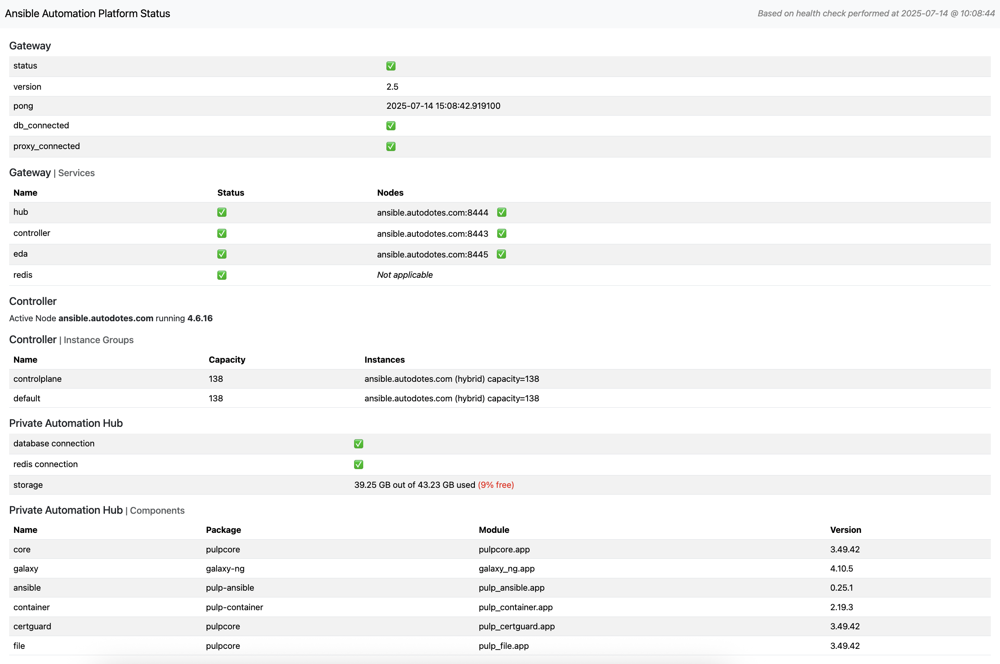

# aap-health-check

Lightweight automation designed to periodically run a health check playbook against an Ansible Automation Platform instance.

Report design based on [Red Hat Access article](https://access.redhat.com/solutions/7113839) outlining how to perform a health check of Ansible Automation Platform.

## usage

The containerized deployment for a one-shot report is publicly available in Quay<br>
`podman pull quay.io/zleblanc/aap-health-check:v2`

The report is dependent on environment variables and volumes provided as podman options at runtime. See instructions below based on your version of AAP.

### version agnostic

| Type | Example | Purpose |
| --- | --- | --- |
| Environment | `--env HEALTH_CHECK_VALIDATE_CERTS="True"` | Determines whether or not to validate the AAP certificates |
| Environment | `--env NGINX_SERVER_NAME="status.example.com"` | Configures nginx to listen on server name for ssl (optional) |
| Volume | `-v /local/path/to/cert:/etc/ssl/nginx.pem` | Mount an SSL certificate to expected location (optional) |
| Volume | `-v /local/path/to/key:/etc/ssl/nginx.key` | Mount an SSL key to expected location (optional) |

### 2.5+

Create a token for a user with required permissions. The report has been tested using a System Auditor token with read scope. Tokens can be created by navigating to **Access Management > Users > {Logged In User} > Tokens > Create Token**.

The following environment variables will be required to generate the report:
| Type | Example | Purpose |
| --- | --- | --- |
| Environment | `--env GATEWAY_HOSTNAME="https://aap.example.com"` | Host URL for the platform API |
| Environment | `--env GATEWAY_API_TOKEN="s3cr3t"` | Token for the platform API (System Auditor read scope sufficient) |
| Secret | `gateway_token,type=env,target=GATEWAY_API_TOKEN"` | Secure way to pass above token - see instructions below for creating secret |

For security purposes, I recommend passing the token as a podman secret. You can create a podman secret from the token environment variable with the following command:<br>
```
podman secret create --env=true gateway_token GATEWAY_API_TOKEN
```

#### run command

```
podman run -p 8080:8080 \
  --env GATEWAY_HOSTNAME="https://aap.example.com" \
  --secret gateway_token,type=env,target=GATEWAY_API_TOKEN \
  quay.io/zleblanc/aap-health-check

# verify
curl http://localhost:8080/health
{"status": "AAP health check is up"}

# browse to http://localhost:8080 to view report
```

#### run with ssl command

```
podman run -p 8443:8443 \
  --env GATEWAY_HOSTNAME="https://aap.example.com" \
  --secret gateway_token,type=env,target=GATEWAY_API_TOKEN \
  --env NGINX_SERVER_NAME="status.example.com" \
  -v /local/path/to/cert:/etc/ssl/nginx.pem \
  -v /local/path/to/key:/etc/ssl/nginx.key \
  quay.io/zleblanc/aap-health-check

# verify
curl https://status.example.com:8443/health
{"status": "AAP health check is up"}

# browse to https://status.example.com:8443 to view report
```

### 2.4 (and earlier)

Create a token for a user with required permissions. For a comprehensive report, you will need to create a token for Controller and Private Automation Hub.

The following environment variables will be required to generate the report:
| Type | Example | Purpose |
| --- | --- | --- |
| Environment | `--env CONTROLLER_HOSTNAME="https://controller.example.com"` | Host URL for the controller API |
| Environment | `--env CONTROLLER_API_TOKEN="s3cr3t"` | Token for the controller API (System Auditor read scope sufficient) |
| Secret | `--secret controller_token,type=env,target=CONTROLLER_API_TOKEN` | Secure way to pass above token - see instructions below for creating secret |
| Environment | `--env PAH_HOSTNAME="https://controller.example.com"` | Host URL for the automation hub API |
| Environment | `--env PAH_API_TOKEN="s3cr3t"` | Token for the automation hub API (System Auditor read scope sufficient) |
| Secret | `--secret pah_token,type=env,target=PAH_API_TOKEN` | Secure way to pass above token - see instructions below for creating secret |

For security purposes, I recommend passing the token as a podman secret. You can create a podman secret from the token environment variable with the following command:<br>
```
podman secret create --env=true controller_token CONTROLLER_API_TOKEN
podman secret create --env=true pah_token PAH_API_TOKEN
```

#### run command

```
podman run -p 8080:8080 \
  --env CONTROLLER_HOSTNAME="https://controller.example.com" \
  --secret controller_token,type=env,target=CONTROLLER_API_TOKEN \
  --env PAH_HOSTNAME="https://pah.example.com" \
  --secret pah_token,type=env,target=PAH_API_TOKEN \
  quay.io/zleblanc/aap-health-check

# verify
curl http://localhost:8080/health
{"status": "AAP health check is up"}

# browse to http://localhost:8080 to view report
```

#### run with ssl command

```
podman run -p 8443:8443 \
  --env CONTROLLER_HOSTNAME="https://controller.example.com" \
  --secret controller_token,type=env,target=CONTROLLER_API_TOKEN \
  --env PAH_HOSTNAME="https://pah.example.com" \
  --secret pah_token,type=env,target=PAH_API_TOKEN \
  --env NGINX_SERVER_NAME="status.example.com" \
  -v /local/path/to/cert:/etc/ssl/nginx.pem \
  -v /local/path/to/key:/etc/ssl/nginx.key \
  quay.io/zleblanc/aap-health-check

# verify
curl https://status.example.com:8443/health
{"status": "AAP health check is up"}

# browse to https://status.example.com:8443 to view report
```

## healthy report (v1)

[Static Report](https://reports.autodotes.com/misc/aap_health_check.html)

